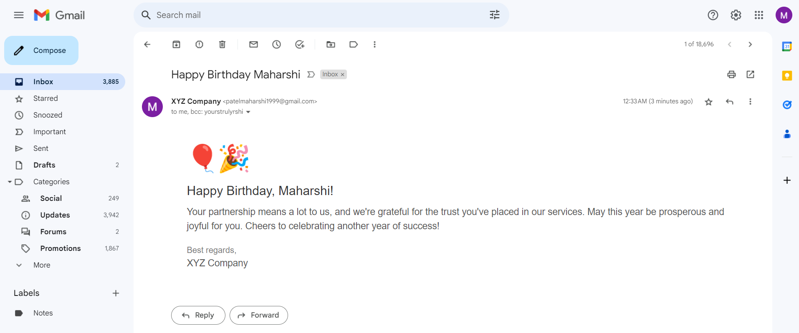

# GSheetBirthdayMailer
Automated birthday email sender via Google Sheets. Zero server costs. Personalized greetings with Google Sheets integration.

## Description
GSheetBirthdayMailer is a clever and cost-effective solution designed to automate the process of sending birthday emails to employees using Google Sheets. This project leverages the power of Google Sheets' data management capabilities and integrates it seamlessly with an automated email system, ensuring that your employees' birthdays are never overlooked again.

## Key Features
* **Zero Server Costs**: GSheetBirthdayMailer operates with an impressive cost efficiency of $0 for server expenses, making it an ideal solution for businesses of all sizes.
* **Google Sheets Integration**: Harnessing the power of Google Sheets, the project fetches and manages employee birthday data, eliminating the need for complex databases or dedicated servers.
* **Automated Email Delivery**: Say goodbye to manual birthday reminders. GSheetBirthdayMailer automates the process by sending personalized birthday emails to employees, making them feel valued and appreciated.
* **Customizable Templates**: Tailor the birthday email templates to match your company's branding and culture, adding a personal touch to each message.
* **Scheduled Sending**: Configure the system to send birthday emails at specific times of the day, ensuring that your employees receive their greetings right when they matter most.

## How It Works
* **Data Input**: Input employee details, including names and birthdates, into a designated Google Sheet.
* **Automation Trigger**: At specified intervals, GSheetBirthdayMailer automatically scans the Google Sheet for upcoming birthdays.
* **Email Generation**: The system generates personalized birthday emails using the provided templates and employee names.
* **Email Delivery**: Emails are sent to the respective employees' email addresses, spreading joy and fostering a positive workplace culture.

GSheetBirthdayMailer is not just an automation tool; it's a way to enhance employee engagement and foster a sense of community within your organization. Experience the ease of automated birthday greetings without the burden of server costs – all thanks to Google Sheets.
